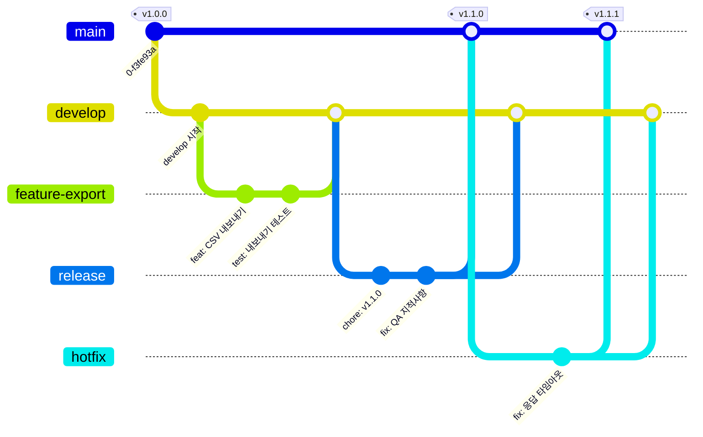

# 브랜치 전략 (Git Flow)

Git Flow 를 기본 브랜치 전략으로 사용합니다.

> **왜 Git Flow 인가**
> 우리 산출물 상당수는 상시 배포되는 웹 서비스가 아니라, **고객 환경에 설치되어 동작하는 프로그램**입니다.
> 이미 나간 버전이 고정돼 있고, 그 버전에만 긴급 수정을 넣어야 하는 상황이 자주 생깁니다.
> `main` 을 "실제로 나가 있는 것", `develop` 을 "다음 릴리스에 나갈 것"으로 분리해야
> 개발 중인 코드가 실수로 배포되는 사고를 막을 수 있습니다.
>
> 반대로 상시 배포되는 내부 웹 서비스라면 이 전략은 과합니다.
> 그런 저장소는 `main` + `feature/*` 만 쓰는 단순한 형태(GitHub Flow)를 선택하고,
> 저장소 `README` 에 "GitHub Flow 사용" 이라고 명시하세요.

---

## 1. 브랜치 종류

| 브랜치 | 수명 | 파생(from) | 병합(into) | 설명 |
|---|---|---|---|---|
| `main` | 영구 | - | - | 릴리스된 코드만 존재. 모든 커밋에 버전 태그가 붙는다. |
| `develop` | 영구 | `main` | - | 다음 릴리스에 포함될 통합 브랜치. 기본 브랜치(default branch). |
| `feature/*` | 임시 | `develop` | `develop` | 기능 개발 단위. |
| `release/*` | 임시 | `develop` | `main`, `develop` | 릴리스 준비(버전 확정, QA 수정). |
| `hotfix/*` | 임시 | `main` | `main`, `develop` | 배포된 버전의 긴급 수정. |

`main` 과 `develop` 은 절대 삭제하지 않습니다.
나머지는 **머지 후 즉시 삭제**합니다. (저장소 설정에서 자동 삭제 켜기)

---

## 2. 전체 흐름



> 다이어그램의 `feature-export`, `release`, `hotfix` 는 실제로는
> `feature/42-csv-export`, `release/1.1.0`, `hotfix/1.1.1-response-timeout` 처럼 이름을 붙입니다.

---

## 3. 브랜치 네이밍 규칙

형식: `<type>/<이슈번호>-<영소문자-하이픈-요약>`

```
feature/42-csv-export
feature/108-track-renderer
fix/55-token-refresh
release/1.2.0
hotfix/1.2.1-response-timeout
```

**규칙**

- 이슈 번호를 **반드시** 앞에 붙입니다. 브랜치만 봐도 맥락을 찾을 수 있어야 합니다.
- 요약은 **영소문자 + 하이픈**만 사용합니다. 한글·공백·대문자·언더스코어 금지.
  → Windows/Linux/macOS 혼용 환경에서 대소문자 구분 문제와 인코딩 깨짐을 피하기 위함.
- 3~5 단어 이내로 짧게 씁니다.
- `release/`, `hotfix/` 는 이슈 번호 대신 **버전 번호**를 씁니다.

**사용 가능한 type**

| type | 용도 |
|---|---|
| `feature/` | 새 기능 |
| `fix/` | 버그 수정 (긴급하지 않은 것. 긴급은 `hotfix/`) |
| `refactor/` | 동작 변화 없는 구조 개선 |
| `docs/` | 문서만 수정 |
| `chore/` | 빌드·설정·의존성 등 |
| `release/` | 릴리스 준비 |
| `hotfix/` | 배포본 긴급 수정 |

---

## 4. 시나리오별 절차

### 4-1. 기능 개발

```bash
# 1. develop 최신화 후 분기
git switch develop
git pull origin develop
git switch -c feature/42-csv-export

# 2. 작업 + 커밋 (커밋 컨벤션 문서 참고)
git add .
git commit -m "feat(export): CSV 내보내기 추가"

# 3. 푸시
git push -u origin feature/42-csv-export

# 4. develop 으로 PR 생성 → 리뷰 → Squash merge
```

**작업이 길어지면 중간중간 develop 을 가져옵니다.**

```bash
git switch feature/42-csv-export
git fetch origin
git rebase origin/develop     # 혼자 쓰는 브랜치면 rebase
# git merge origin/develop    # 여러 명이 같이 쓰는 브랜치면 merge
```

> 이미 푸시한 브랜치를 rebase 하면 강제 푸시(`--force-with-lease`)가 필요합니다.
> 다른 사람이 그 브랜치를 받아 쓰고 있다면 rebase 대신 merge 를 쓰세요.

### 4-2. 릴리스

```bash
# 1. develop 에서 release 브랜치 분기
git switch develop
git pull origin develop
git switch -c release/1.2.0

# 2. 버전 번호 확정 (package.json, pyproject.toml, build.gradle 등)
git commit -am "chore(release): v1.2.0"
git push -u origin release/1.2.0

# 3. QA. 이 브랜치에는 버그 수정만 넣습니다. 새 기능 추가 금지.

# 4. main 으로 PR → merge (Squash 아님, Merge commit 사용)

# 5. 태그 생성
git switch main
git pull origin main
git tag -a v1.2.0 -m "Release v1.2.0"
git push origin v1.2.0

# 6. develop 으로 역병합 (QA 수정분 회수)
git switch develop
git merge --no-ff main
git push origin develop

# 7. release 브랜치 삭제
git push origin --delete release/1.2.0
```

> **6번을 빼먹지 마세요.** 가장 흔한 사고가 릴리스 중 고친 버그가
> `develop` 에 반영되지 않아 다음 릴리스에서 그대로 되살아나는 것입니다.

### 4-3. 핫픽스

```bash
# 1. main 에서 분기 (develop 아님!)
git switch main
git pull origin main
git switch -c hotfix/1.2.1-response-timeout

# 2. 수정 + 패치 버전 올리기
git commit -am "fix(client): 외부 연동 응답 타임아웃 3초로 연장"
git commit -am "chore(release): v1.2.1"
git push -u origin hotfix/1.2.1-response-timeout

# 3. main 으로 PR → merge → 태그
git switch main
git pull origin main
git tag -a v1.2.1 -m "Hotfix v1.2.1"
git push origin v1.2.1

# 4. develop 으로도 반드시 병합
git switch develop
git merge --no-ff main
git push origin develop
```

---

## 5. 머지 전략

| 대상 | 방식 | 이유 |
|---|---|---|
| `feature/*` → `develop` | **Squash and merge** | develop 히스토리를 기능 1개 = 커밋 1개로 유지. "wip", "오타 수정" 같은 커밋이 남지 않음. |
| `release/*` → `main` | **Create a merge commit** | 릴리스 시점이 히스토리에 남아야 함. squash 하면 태그와 커밋 대응이 깨짐. |
| `hotfix/*` → `main` | **Create a merge commit** | 위와 동일. |
| `main` → `develop` (역병합) | **`git merge --no-ff`** | 병합 사실 자체를 기록. |

저장소 설정에서 **Rebase and merge 는 비활성화**합니다.
누가 어떤 방식으로 머지했는지 예측 불가능해지는 것을 막기 위함입니다.

---

## 6. 버전 번호 (SemVer)

`vMAJOR.MINOR.PATCH` 형식을 사용합니다. 태그에는 `v` 접두사를 붙입니다.

| 자리 | 올리는 시점 | 예 |
|---|---|---|
| MAJOR | 하위 호환이 깨지는 변경 | 프로토콜 변경, 설정 파일 포맷 변경 |
| MINOR | 하위 호환되는 기능 추가 | 새 화면, 새 API 엔드포인트 |
| PATCH | 버그 수정 | 크래시 수정, 타임아웃 조정 |

- 정식 릴리스 전에는 `v0.x.y` 를 사용하고, 이 구간에서는 MINOR 가 깨지는 변경을 포함할 수 있습니다.
- 사전 배포본은 `v1.2.0-rc.1`, `v1.2.0-beta.1` 처럼 표기합니다.

---

## 7. 브랜치 보호 규칙

각 저장소 `Settings → Branches` 에서 아래를 설정합니다.

### `main`

- [x] Require a pull request before merging
- [x] Require approvals: **1** 이상
- [x] Dismiss stale pull request approvals when new commits are pushed
- [x] Require status checks to pass before merging (CI 가 있는 경우)
- [x] Require branches to be up to date before merging
- [x] Do not allow bypassing the above settings
- [x] Restrict who can push (관리자만)
- [ ] Allow force pushes — **반드시 꺼둘 것**
- [ ] Allow deletions — **반드시 꺼둘 것**

### `develop`

- [x] Require a pull request before merging
- [x] Require approvals: **1** 이상
- [x] Require status checks to pass before merging (CI 가 있는 경우)
- [ ] Allow force pushes — **반드시 꺼둘 것**

### 저장소 공통 설정

- Default branch: **`develop`**
- [x] Automatically delete head branches (머지된 브랜치 자동 삭제)
- Allow merge commits: **on**
- Allow squash merging: **on**
- Allow rebase merging: **off**

`gh` CLI 로 한 번에 적용하려면:

```bash
REPO=<org>/<repo>

gh api -X PATCH repos/$REPO \
  -f default_branch=develop \
  -F delete_branch_on_merge=true \
  -F allow_merge_commit=true \
  -F allow_squash_merge=true \
  -F allow_rebase_merge=false

for BR in main develop; do
  gh api -X PUT repos/$REPO/branches/$BR/protection \
    -H "Accept: application/vnd.github+json" \
    -F required_pull_request_reviews[required_approving_review_count]=1 \
    -F required_pull_request_reviews[dismiss_stale_reviews]=true \
    -F enforce_admins=true \
    -F allow_force_pushes=false \
    -F allow_deletions=false \
    -f required_status_checks=null \
    -f restrictions=null
done
```

> 브랜치 보호는 GitHub Team 플랜 이상에서 private 저장소에 적용됩니다.
> Free 플랜 private 저장소라면 보호 규칙 대신 **팀 합의 + PR 필수 문화**로 운영합니다.

---

## 8. 자주 하는 실수

| 상황 | 왜 문제인가 | 어떻게 |
|---|---|---|
| `main` 에서 feature 브랜치를 팠다 | 릴리스되지 않은 develop 변경분이 빠져 머지 시 충돌 폭탄 | `develop` 에서 분기. 이미 그랬다면 `git rebase --onto develop main <branch>` |
| 핫픽스를 `develop` 에서 팠다 | 아직 릴리스 안 된 기능이 딸려 들어가 배포됨 | `main` 에서 분기 |
| 릴리스 후 develop 역병합을 안 했다 | QA 중 고친 버그가 다음 릴리스에서 부활 | 릴리스 절차 6번 필수 실행 |
| release 브랜치에 새 기능을 추가했다 | QA 범위가 무한정 늘어나 릴리스가 안 끝남 | 새 기능은 `develop` 으로. 다음 릴리스에 포함 |
| feature 브랜치가 2주 넘게 살아있다 | develop 과 벌어져 머지 비용이 기하급수적으로 증가 | 기능을 더 잘게 쪼개서 이슈부터 분리 |
| 브랜치를 안 지운다 | 브랜치 목록에서 진행 중인 작업을 못 찾음 | 자동 삭제 설정 + 주기적 정리 |

---

## 9. 관련 문서

- [커밋 컨벤션](commit-convention.md)
- [PR 가이드](pull-request.md)
- [이슈 가이드](issue.md)
